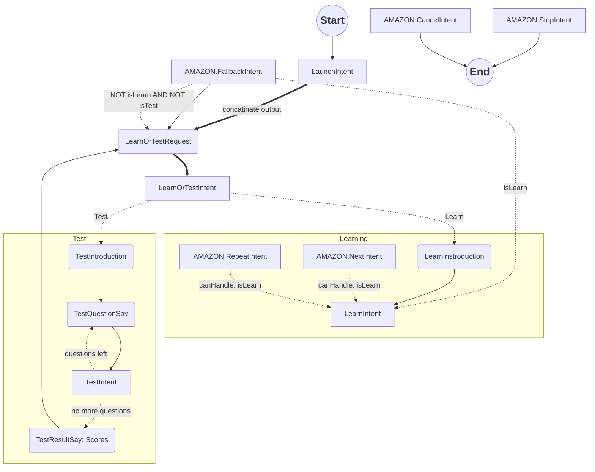

# Description

<strong>WIP!</strong>
German prepositions trainer.
Based on skill-sample-nodejs-hello-world.

# Dependencies

- ask-cli
- lambda-local

# Deployment
ask deploy

# States

## Intents

- **LaunchIntent**
  - speechText: Hello ...
- **LearnOrTestRequest**
  - speechText: What would you like to do?
  - reset state
  - state => `mode-selection`
- **LearnOrTestIntent**
  - canHandle: state == `mode-selection`
  - samples: "learn" | "test"
  - state => `learn` OR `test`
- **LearnInstroduction**
  - speechText: Instruction - next or stop
- **LearnIntent**
  - Preposition Info with sample
- **TestIntroduction**
  - speechText:  short instruction (answer format) + pause
- **TestIntent**
  - if no questions
    - generate 10 question
  - if answer
    - add answer result + pause
  - speechText: TestQuestionSay
- **TestQuestionSay**
    - if first question:
      - speechText: a question
    - else:
      - speechText: next question + a question
- **AMAZON.FallbackIntent**
- **AMAZON.HelpIntent**
- **AMAZON.CancelInten**
- **AMAZON.NextIntent**
- **AMAZON.RepeatIntent**
- **AMAZON.StopIntent**

