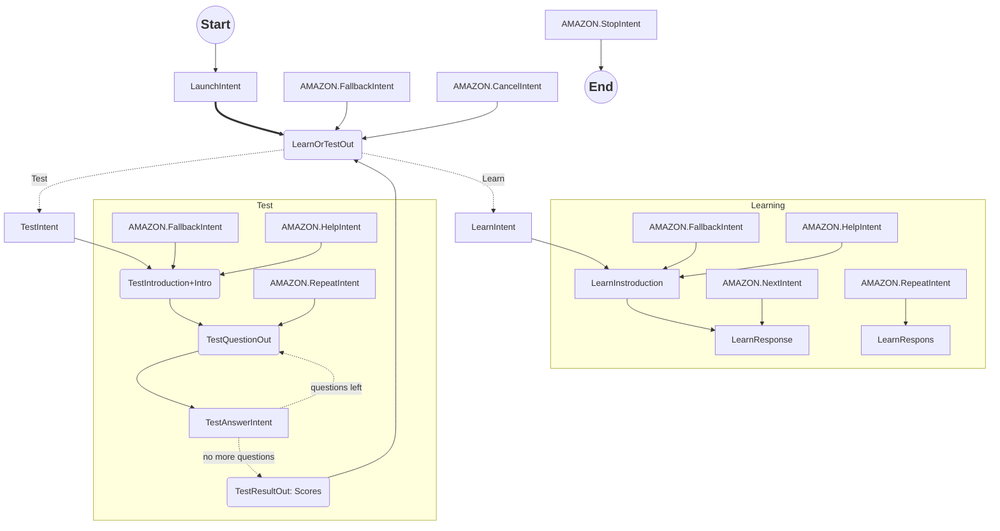

# Description

<strong>WIP!</strong>
German prepositions trainer.
Based on skill-sample-nodejs-hello-world.

# TODO

- Add AMAZON.StartOverIntent
- Add A&D songs

"von","auf","mit","über","für","bei","um","aus","an","zu","nach","unter","gegen","vor","in"

# Dependencies

- ask-cli
- lambda-local

# Deployment
ask deploy

# States

